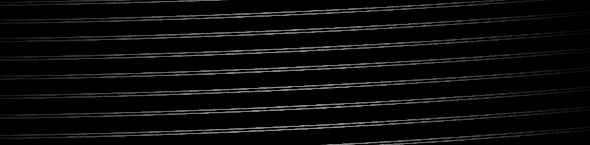

Usage
=====

Here, it is assumed that one of the provided spectrograph HDF model files is used or that the appropriate model has been
created from the ZEMAX file.
If not please go to here to generate your own spectrograph model.

Basics
^^^^^^
Echelle++ is controlled via command line arguments.

.. code-block:: bash

    ./echellesimulator -h

lists all available arguments.

This makes it easy for Echelle++ to be scripted. Look at the examples folder to see how Echelle++ can be called within python.

Example 1: Flat
^^^^^^^^^^^^^^^
As a first example, we simulate a flat field. Or more precisely, we use a source of constant spectral density.

.. code-block:: bash

    ./echellesimulator --spectrograph MaroonX --constant 0.01

.. note:: Since we didn't specify the integration time manually, a default value of 1s is used.

The output will look like this (partly shown):

.. image:: plots/example1.jpg

.. note:: Due to the photon-wise generation of the spectrum, all generated spectra naturally show photon noise. For a high signal to noise (S/N) spectrum, increase the integration time.

Example 2: multiple fibers
^^^^^^^^^^^^^^^^^^^^^^^^^^
For multiple fiber spectrographs, we need one call to Echelle++ for each fiber.
In the following example, we simulate a flat spectrum in the first two fibers of the MaroonX spectrograph.

.. code-block:: bash

    ./echellesimulator --spectrograph MaroonX --constant 0.01 -o flat2.fit
    ./echellesimulator --spectrograph MaroonX --constant 0.01 -f 2 -k 1 -o flat2.fit

.. warning:: The -k 1 flag of the second command makes sure that the content of flat2.fit will not be overwritten, but rather added to the current simulation. If the flag was not given, the second command would overwrite the file.

The output should look like this (partly shown):

Example 3: A stellar source + RV shift
^^^^^^^^^^^^^^^^^^^^^^^^^^^^^^^^^^^^^^
When simulating stellar sources, a visual magnitude of the source has to be provided. Also, a telescope size should be provided, otherwise, a default telescope of 1m diameter is used to calculate the photon flux.
Here, we specify a telescope of 8.1m diameter and 128.12m focal length, a integration time of 60s. Our source is a simulated M-dwarf spectrum using the `PHOENIX simulations <https://www.aanda.org/articles/aa/abs/2013/05/aa19058-12/aa19058-12.html>`_ with an effective temperature of 3500 K, Z=-1.0, alpha=0. and surface gravity of log_g=5.5.
We also set the radial velocity to 50 m/s.

.. code-block:: bash

    ./echellesimulator --spectrograph MaroonX --telescope 8.1,128.12 --phoenix 3500,-1.,0.,5.5,6 -t 60 -r 50
    ./echellesimulator --spectrograph MaroonX --telescope 8.1,128.12 --phoenix 3500,-1.,0.,5.5,6 -t 60 -r 50 -k 1 -f 2
    ./echellesimulator --spectrograph MaroonX --telescope 8.1,128.12 --phoenix 3500,-1.,0.,5.5,6 -t 60 -r 50 -k 1 -f 3

Example 4: A line catalogue:
^^^^^^^^^^^^^^^^^^^^^^^^^^^^
We can simulate line lists by providing a .csv file with the following column structure: "<wavelength>[micron];<intensity>"
The intensity should be scaled to number of photons per second.
